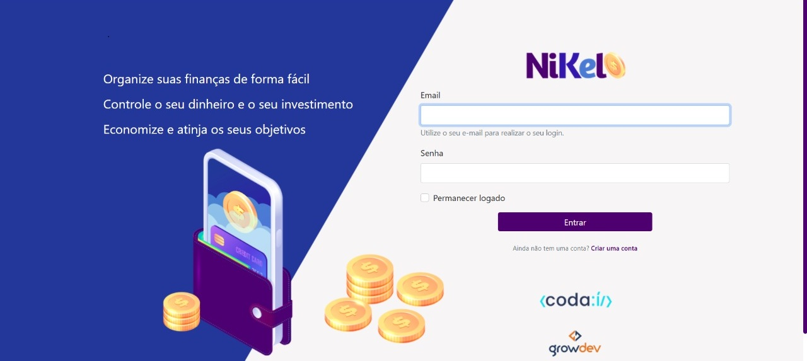
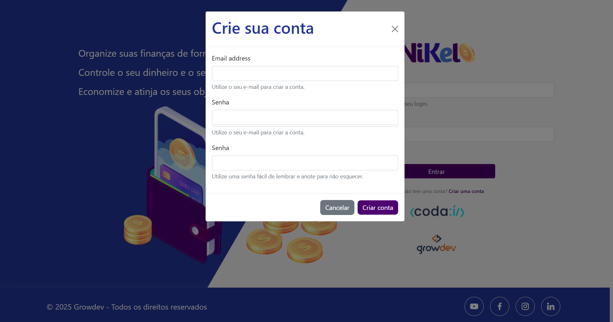
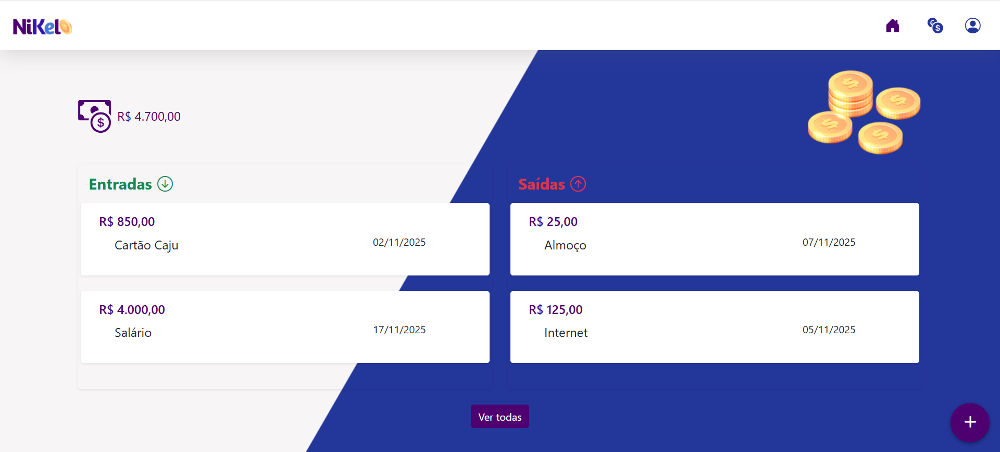

# Nikel - Aplicativo de Controle Financeiro Pessoal

Este aplicativo foi desenvolvido no contexto do Edital de Seleção para a Concessão de Bolsas de Formação em **Desenvolvimento de Software Back-End**, **Desenvolvimento Mobile** e **VTEX.IO**, concedidos pela GROWDEV e VESTE S.A. O programa visa capacitar pessoas selecionadas para trilhas formativas intensivas em tecnologias como `Node.js`, `C#`, `Flutter` e `VTEX.IO`, com bolsas integrais para aprovados. O projeto exemplifica na prática os conhecimentos adquiridos, mostrando uma aplicação web para controle financeiro pessoal. Para mais informações, acesse: https://growdev.com.br/vestetech/

Segue as páginas de divulgações:
[1](https://www.seprorgs.org.br/noticias/ver/3338/growdev-e-veste-lancam-programa-de-formacao-gratuita-em-tecnologia-com-60-bolsas-e-possibilidade-de-contratacao)
[2](https://www.correio24horas.com.br/economia/empregos/veste-sa-e-growdev-lancam-programa-de-formacao-gratuita-em-desenvolvimento-de-software-1025)
[3](https://growdev.com.br/vestetech/)
[4](https://www.feevale.br/acontece/noticias/growdev-e-veste-lancam-programa-de-formacao-gratuita-em-tecnologia-com-bolsas-e-possibilidade-de-contratacao)

## Trilha Codaí 2.0

## Descrição

Aplicativo web **Nikel** para controle financeiro pessoal, permiti visualizar saldos, cadastrar lançamentos de entradas e saídas, consultar histórico e manter uma experiência visual moderna e responsiva.

## Funcionalidades

- Login, cadastro e controle simples de usuários.
- Visualização do saldo e listagem rápida de entradas e saídas.
- Cadastro de lançamentos financeiros com data, descrição e tipo.
- Histórico completo de transações por usuário.
- Scrollbar personalizada para maior integração visual.
- Feedback instantâneo de ações e modais interativas.

## Tecnologias Utilizadas

- HTML5, CSS3, JavaScript puro para estrutura e lógica.
- [Bootstrap 5.1.3](https://getbootstrap.com/docs/5.1/getting-started/introduction/) para estilização e componentes responsivos (modais, botões, navbar).
- LocalStorage e SessionStorage para armazenamento local das contas/sessões.

## Estrutura do Projeto

- `index.html`: Tela de login e cadastro.  
  
  

- `home.html`: Tela principal, resumo do saldo, entradas, saídas, navegação.
  
- `transactions.html`: Histórico detalhado das transações.
  
- `css/style.css`: Estilização completa e visual das páginas.
- `js/index.js`, `js/home.js`, `js/transactions.js`: Lógica JS de autenticação, cadastro, lançamentos e listagem.
- `assets/images/`: Imagens do projeto e logos.

## Como Usar

1. Abra `public/index.html` para acessar login/cadastro.
2. Após login, acesse resumo financeiro e visualize/adicione lançamentos.
3. Navegue para o histórico de todas as transações em `transactions.html`.
4. As funções do aplicativo são 100% client-side, sem backend.
5. Faça logout para encerrar a sessão.

## Considerações Técnicas

- Persistência dos dados ocorre apenas no navegador, por usuário.
- Modais são controladas via JavaScript, garantindo navegação fluida.
- Aplicativo leve e responsivo, pensado para desktop, tablet e mobile.

## Contribuição & Contato

Sugestões, melhorias e contatos podem ser enviados para o desenvolvedor. Sinta-se à vontade para contribuir!

## Contato:

Desenvolvido por **Emerson Pessoa**  
[e-mail](mailto:emersonpessoa011108@gmail.com) 
<a href="https://www.linkedin.com/in/emersonpessoa01/" target="_blank">Linkedin</a>
