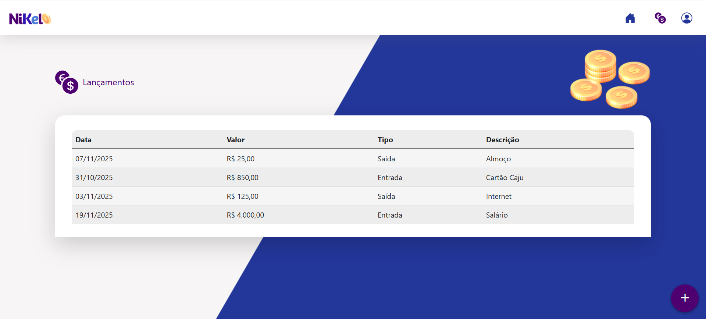

# Nikel - Aplicativo de Controle Financeiro Pessoal

Este aplicativo foi desenvolvido no contexto do Edital de Seleção para a Concessão de Bolsas de Formação em **Desenvolvimento de Software Back-End**, **Desenvolvimento Mobile** e **VTEX.IO**, concedidos pela GROWDEV e VESTE S.A. O programa visa capacitar pessoas selecionadas para trilhas formativas intensivas em tecnologias como `Node.js`, `C#`, `Flutter` e `VTEX.IO`, com bolsas integrais para aprovados. O projeto exemplifica na prática os conhecimentos adquiridos, mostrando uma aplicação web para controle financeiro pessoal. Para mais informações, acesse: https://growdev.com.br/vestetech/

Segue as páginas de divulgações:  
[1](https://www.seprorgs.org.br/noticias/ver/3338/growdev-e-veste-lancam-programa-de-formacao-gratuita-em-tecnologia-com-60-bolsas-e-possibilidade-de-contratacao)  
[2](https://www.correio24horas.com.br/economia/empregos/veste-sa-e-growdev-lancam-programa-de-formacao-gratuita-em-desenvolvimento-de-software-1025)  
[3](https://growdev.com.br/vestetech/)  
[4](https://www.feevale.br/acontece/noticias/growdev-e-veste-lancam-programa-de-formacao-gratuita-em-tecnologia-com-bolsas-e-possibilidade-de-contratacao)

---

## Trilha Codaí 2.0

## Descrição

Aplicativo web **Nikel** para controle financeiro pessoal, permitindo visualizar saldos, cadastrar lançamentos de entradas e saídas, consultar histórico e manter uma experiência visual moderna e responsiva.

---

## Funcionalidades

- Login, cadastro e controle simples de usuários.
- Visualização do saldo e listagem rápida de entradas e saídas.
- Cadastro de lançamentos financeiros com data, descrição e tipo.
- Histórico completo de transações por usuário.
- Scrollbar personalizada para maior integração visual.
- Feedback instantâneo de ações e modais interativas.

---

## Tecnologias Utilizadas

- HTML5, CSS3, JavaScript puro.
- [Bootstrap 5.1.3](https://getbootstrap.com/docs/5.1/getting-started/introduction/).
- LocalStorage e SessionStorage.

---

## Estrutura do Projeto

- `index.html`: Tela de login e cadastro.  
  
  

- `home.html`: Tela principal, resumo do saldo, entradas, saídas.
  

- `transactions.html`: Histórico detalhado das transações.  
  

- `css/style.css`: Estilização completa.
- `js/*.js`: Lógica de autenticação, cadastro, lançamentos e histórico.
- `public/images/`: Imagens e logos do projeto.

---

## Como Usar

1. Abra `public/index.html` para acessar login/cadastro.
2. Após login, visualize o saldo e adicione lançamentos.
3. Consulte o histórico em `transactions.html`.
4. 100% client-side, sem backend.
5. Use `Logout` para encerrar sessão.

---

## Considerações Técnicas

- Persistência apenas no navegador do usuário.
- Modais controladas via JavaScript.
- Layout responsivo para desktop, tablet e mobile.

---

## Contribuição

Sugestões e melhorias são bem-vindas!

---

## Contato

Desenvolvido por **Emerson Pessoa**  
[e-mail](mailto:emersonpessoa011108@gmail.com)  
[LinkedIn](https://www.linkedin.com/in/emersonpessoa01/)
